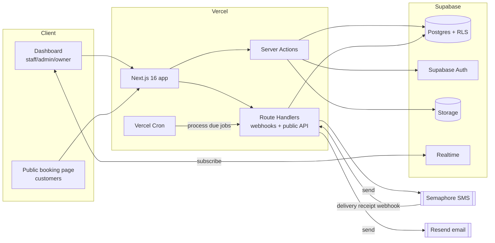
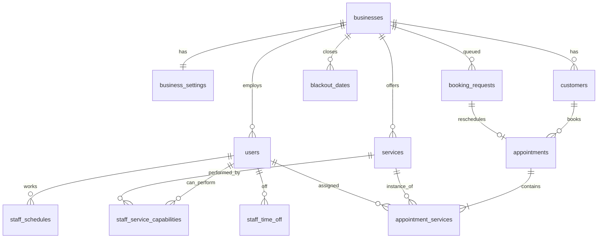

# Technical Specification

Engineering spec for the dashboard-management SaaS — a booking + customer management platform
for small clinics, wellness spas, and similar appointment-based businesses (PH market).

This document settles the stack, data model, and cross-cutting infrastructure. It is the
implementation companion to the product flows in [workflows/](workflows/README.md) — read the
workflows for *what* the app does; read this for *how* it's built. Where a rule (buffer, 5h
reminder, role gating, phone-uniqueness) is defined in a workflow, this doc references it rather
than restating it.

## 1. Goals & constraints

- **One business per account** (single-tenant-per-account). No multi-location in v1.
- **Roles:** Owner / Admin / Staff (see [workflows README](workflows/README.md#shared-concepts)).
- **Market: Philippines.** Phone is the customer source of truth; SMS is the costly channel and is
  reserved for customer-facing transactional messages (see [notifications](workflows/notifications.mmd)).
- **Low ops for v1** — favor managed services over self-run infrastructure.
- **Out of scope (v1):** billing/subscriptions, OTT channels (Viber/WhatsApp), multi-location, mobile app.

## 2. Stack

| Layer | Choice | Notes |
|---|---|---|
| Framework | **Next.js 16** (App Router), **React 19** | Already scaffolded |
| Language | **TypeScript** (strict) | |
| Styling/UI | **Tailwind v4**, **shadcn/ui** (Base UI + Radix) | `react-day-picker`, `input-otp`, `sonner`, `recharts`, `date-fns` |
| Hosting | **Vercel** | Preview deploys; Vercel Cron for schedules |
| Database | **Supabase Postgres** | Region: Singapore (closest to PH) |
| ORM / migrations | **Prisma** | Schema + migrations; use Supabase pooled URL (Supavisor) at runtime, direct URL for migrations |
| Auth (staff) | **Supabase Auth** | Email+password, email verification, invites |
| Row security | **Supabase RLS** | Tenant isolation by `business_id` |
| Server logic | **Server Actions** (mutations) + **Route Handlers** (webhooks, public API) | |
| Background jobs | **Vercel Cron + `jobs` table** | Reminders, hold/OTP/invite expiry, notification retries |
| SMS | **Semaphore** | Customer-facing transactional only |
| Email | **Resend** | Verification, invites, business alerts; also Supabase Auth SMTP |
| File storage | **Supabase Storage** | Branding/logo uploads |
| Realtime | **Supabase Realtime** | In-app business alerts (new/reschedule requests) |
| Validation | **Zod** | Shared client + server schemas |
| Testing | **Vitest** (unit) + **Playwright** (e2e) | |

## 3. Architecture



## 4. Data model

All domain tables carry `business_id` (FK → `businesses.id`) and are isolated by RLS. UUID primary
keys (Supabase default). Timestamps stored as `timestamptz` (UTC); all scheduling math is done in
the **business timezone** stored on `businesses`.

**Core entities**

- `businesses` — name, type, address, **timezone**, contact, branding (logo URL, colors),
  onboarding_complete, status (active/closed).
- `business_settings` — operating hours (per weekday), buffer (none/5/10/15), **slot_interval = 15
  min**, min_lead_time, reschedule/cancel notice windows, booking_policy (auto_confirm |
  requires_approval, default requires_approval), online_booking_enabled, reminder_enabled,
  default opt-out flags, sender_id.
- `blackout_dates` — business-level closures (holidays).
- `users` — maps to Supabase Auth user; role (owner/admin/staff), status (active/suspended),
  name. Exactly **one owner per business** (enforced by a partial unique index).
- `invites` — email, role, capabilities, token, status (pending/accepted/revoked), expires_at.
- `customers` — name, **phone (UNIQUE per business)**, email (optional), notes, deleted_at (soft
  delete). Phone is the match key for public booking.
- `services` — name, duration_min, price, bookable_online (bool), archived_at.
- `staff_service_capabilities` — (user_id, service_id) — which staff can perform which service.
- `staff_schedules` — per-staff working hours, breaks; `staff_time_off` — date ranges.
- `appointments` — the **parent visit**: customer_id, status (pending/confirmed/completed/
  cancelled/no_show), start_at, end_at (computed window), source (staff | public), cancel_reason.
- `appointment_services` — the **child line-items**: appointment_id, service_id, staff_id
  (nullable when "any available" pending assignment), start_at, end_at, status.
- `booking_requests` — pending public requests (new | reschedule); payload, requested slot,
  linked appointment (for reschedule), status, expires_at.
- `slot_holds` — temporary reservation during public checkout: staff_id/service window,
  expires_at. **Subtracted by the availability engine** to prevent races.
- `phone_verifications` — public-booking OTP: phone, code_hash, attempts, expires_at.
- `notifications` — audit log of every send: audience (business/customer), channel, type, status,
  template, recipient, attempts.
- `jobs` — durable work queue (see §7): type, run_after, status, attempts, last_error, payload.



## 5. Auth, tenancy & access control

- **Staff accounts** (owner/admin/staff) use **Supabase Auth** (email + password). Email
  verification on signup; invited users skip verification (the invite link proves the email — see
  [dashboard-access](workflows/dashboard-access.mmd)). Sessions via Supabase SSR cookies.
- **Customers are NOT auth users.** Public booking identifies them by **phone + OTP**
  (`phone_verifications`), then matches/creates a `customers` row. The OTP is a custom flow, not
  Supabase phone auth.
- **Tenancy:** every query is scoped to the caller's `business_id`. The user's `business_id` is
  attached as a JWT claim (via an auth hook reading the `users` row).
- **RLS + Prisma caveat:** Prisma connects through a privileged role and **bypasses RLS by default**,
  so app-layer scoping in Server Actions (always filter by `business_id`, checked against the
  session) is the **primary** guard in v1. RLS policies are still defined on every table and apply
  to any access via the Supabase client (e.g. Realtime subscriptions, Storage, future direct
  queries). If we want RLS to also cover Prisma traffic, route it through a non-privileged role and
  `SET LOCAL request.jwt.claims` per transaction — deferred unless needed.
- **Role gating** (Owner/Admin/Staff) from the workflows is enforced in Server Actions *and*
  mirrored in RLS where feasible. Staff = read-only on customers/bookings; writes require Admin/Owner.

## 6. Server logic & API surface

- **Server Actions** — all authenticated dashboard mutations (create/edit/cancel booking, manage
  customers/staff/services, settings). Input validated with Zod; authorization checked at the top
  of each action (role + business scope).
- **Route Handlers** (`app/api/.../route.ts`) — for anything that isn't a logged-in dashboard
  action:
  - `POST /api/public/bookings` and the public availability search (no session; rate-limited).
  - `POST /api/public/otp` (request) — generates + sends OTP via Semaphore.
  - `POST /api/webhooks/semaphore` — delivery receipts (verify signature).
  - `GET /api/cron/*` — invoked by Vercel Cron; protected by a cron secret.
- **Validation:** Zod schemas live in a shared module and are reused client-side (forms) and
  server-side (actions/handlers).

## 7. Background jobs & scheduling

A `jobs` table is the durable queue; **Vercel Cron** ticks a Route Handler every few minutes that
claims due jobs (`run_after <= now`, status `pending`), processes them, and records
attempts/errors with exponential backoff. This realizes the retry/fallback logic in
[notifications](workflows/notifications.mmd) without an external queue.

Scheduled / recurring work:

| Job | Trigger | Action |
|---|---|---|
| **Reminder scan** | cron ~every 5–15 min | Find appointments crossing the **5h-before** mark (skip if booked < 5h out) → enqueue reminder send |
| **Slot-hold expiry** | cron | Release `slot_holds` past `expires_at` (frees availability) |
| **OTP expiry** | cron | Purge expired `phone_verifications` |
| **Invite expiry** | cron | Mark `invites` past `expires_at` as expired |
| **Booking-request expiry** | cron | Expire untouched public requests; release held slot ([public-booking](workflows/public-booking.mmd)) |
| **Notification send + retry** | enqueued | Send via Semaphore/Resend; on failure retry, then SMS→email fallback if email on file |

## 8. Availability engine

The shared slot logic in [availability-engine.mmd](workflows/availability-engine.mmd) is
implemented as a **pure server module** (no I/O beyond the data it's handed), so it's unit-testable
in isolation. Two entry points: `validateSlot(...)` and `searchSlots(...)`. It consumes business
hours, blackout dates, buffer, per-staff schedules/time-off/capabilities, existing
`appointment_services`, **active `slot_holds`**, and min lead time. All computation in business
timezone; slot granularity 15 min. Rule of truth: availability derives from *scheduled* blocks —
completing a booking early never frees its slot.

## 9. Notifications

- **Audience routing** ([notifications.mmd](workflows/notifications.mmd)): customer-facing →
  Semaphore SMS (email fallback); business-facing → **in-app (Realtime) + Resend email, never SMS**.
- **Always-send:** OTP, email verification, cancellations. **Opt-out-able:** reminders, booking
  confirmations.
- Keep SMS single-segment GSM-7 (≤160 chars, no emoji/accents). Use short links for manage URLs.
- Every send is logged to `notifications`; sends run through the `jobs` queue for retries.

## 10. Project structure

Root-level App Router layout (matches current scaffold — no `src/`):

```
app/                    # routes; (dashboard) and (public) route groups; api/ handlers
components/ui/          # shadcn primitives (committed)
components/             # feature components
lib/
  db/                   # prisma schema, migrations, generated client
  auth/                 # supabase server/client, session helpers, role guards
  availability/         # the pure slot engine (§8)
  notifications/        # semaphore + resend adapters, templates, dispatcher
  jobs/                 # job types + processors
  validation/           # shared zod schemas
hooks/                  # client hooks (use-mobile committed)
docs/                   # workflows/ + this spec
```

## 11. Environments, config & secrets

- Envs: local → Vercel Preview (per-PR) → Production. Each maps to a separate Supabase project (or
  at least separate schemas) to keep data isolated.
- Secrets (Vercel env vars): Supabase URL + anon/service keys, Semaphore API key + sender name,
  Resend API key, cron secret, app URL.
- DB migrations run via `prisma migrate deploy` in CI on deploy (against the direct DB URL).

## 12. Security

- **RLS everywhere** keyed to `business_id`; never rely on app-layer scoping alone.
- **OTP**: rate-limit per phone + IP, short expiry, hashed codes, capped attempts/resends
  (see [public-booking](workflows/public-booking.mmd)).
- **Public endpoints** rate-limited; webhook handlers verify provider signatures; cron handlers
  require the cron secret.
- Service-role key used only in server contexts, never shipped to the client.

## 13. Observability

- Structured logs on Server Actions / Route Handlers / job processors.
- `notifications` and `jobs` tables double as audit trails (delivery + retry history).
- Vercel analytics + Supabase logs for v1; revisit dedicated error tracking later.

## 14. Open questions / deferred

- **Billing & SMS metering** — out of scope now; will live alongside plan limits when added.
- **OTT channels** — notifications dispatcher is adapter-based so Viber/WhatsApp-primary-with-SMS-
  fallback can slot in later without a rewrite.
- **Staff self-service** (a staff member requesting their own time off) — not modeled; currently
  Admin/Owner manage schedules.
- **Dashboard analytics depth** — `recharts` is available; specific metrics TBD.
