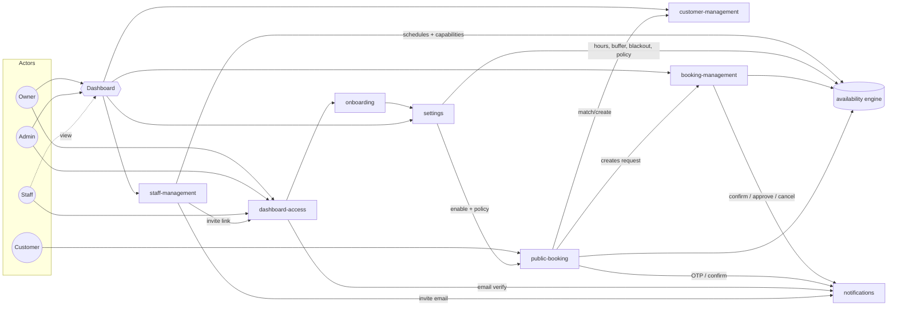

# Workflows

Workflow diagrams (Mermaid `.mmd`) for the dashboard-management SaaS — a booking + customer
management platform for small clinics, wellness spas, and similar appointment-based businesses.
Each business is a single tenant; staff work inside one business's dashboard, and customers book
through that business's public page.

These diagrams capture **product flow and decisions**, not implementation. Read them before
touching feature code so the role gating, booking model, and cross-feature seams stay consistent.

## Overview

## Index

| File | Scope |
|---|---|
| [dashboard-access.mmd](dashboard-access.mmd) | Signup, invite acceptance, login, email verification, role gating |
| [onboarding.mmd](onboarding.mmd) | First-run setup wizard (business profile → hours → services → staff → settings) |
| [settings.mmd](settings.mmd) | Business config hub — profile, hours, blackout, booking rules, policy, services, notifications |
| [customer-management.mmd](customer-management.mmd) | Add / edit / delete (soft) / merge; Staff view-only |
| [booking-management.mmd](booking-management.mmd) | Staff-side bookings, parent+child visits, approval queue, availability link |
| [public-booking.mmd](public-booking.mmd) | Customer self-service — phone + OTP, match-by-phone, slot hold |
| [staff-management.mmd](staff-management.mmd) | Invite, roles, service capabilities, schedules, suspend/remove, ownership transfer |
| [notifications.mmd](notifications.mmd) | Event + scheduled messaging; Semaphore SMS (primary) + email |
| [availability-engine.mmd](availability-engine.mmd) | Shared slot logic (not a user flow) — validate a slot / search open slots |

## Shared concepts

These cut across multiple diagrams — change them in one place and check the others.

**Roles & permissions** (one business per account)

| | Owner | Admin | Staff |
|---|---|---|---|
| Customers | full | full | view only |
| Bookings (create/edit/cancel) | full | full | view only |
| Staff: invite/manage | all | Staff only | view own |
| Settings | full | full (not billing) | none |
| Billing / danger zone | Owner only | — | — |

**Availability engine** ([availability-engine.mmd](availability-engine.mmd)) — not a workflow; the
shared logic that `booking-management`, `public-booking`, and the schedule editors all rely on.
Two modes: **validate** a specific proposed slot, or **search** open slots in a range. Computes from
**scheduled blocks + per-service duration + buffer + per-staff schedules/time-off/capabilities +
business hours/blackout + min lead time**. Key rule: availability is derived from *scheduled* time
only — marking a booking **complete** early does **not** free the remaining slot.

**Booking model** — a **parent appointment** (the visit) holds **1..n child services**. Each child
carries its own service, assigned staff, and duration. Staff have **service capabilities**; the
staff-picker is filtered to who can perform each service. Multi-service visits choose sequential
(contiguous, one staff) or parallel (overlapping, different staff).

**Identity & matching** — customers are matched/created by **phone**, which is a **hard-unique
key** (PH market, source of truth). Staff-side Add **blocks** on a phone collision (email/name are
soft warnings only); this keeps public booking's match-by-phone unambiguous. Public booking gates on
**phone + OTP** before lookup.

**Notification channels** — routing depends on **audience**: **customer-facing** transactional
messages use **Semaphore SMS** (primary; email as verification channel and SMS-failure fallback when
an email is on file); **business-facing** alerts (new/reschedule requests, staff alerts) go
**in-app + email, never SMS** — SMS is the cost driver, reserved for customers. OTP, email
verification, and cancellations always send; reminders + booking confirmations are opt-out-able. One reminder, fixed
**5h before** (skipped if booked < 5h out). Keep SMS single-segment GSM-7.

## Conventions

- `[/.../]` parallelogram nodes are handoffs to another workflow or external service.
- `[(...)]` nodes are persisted state changes (writes).
- `{...}` nodes are decisions/branches.
- A `CanWrite`-style role check guards write actions; viewing is generally open within a role's scope.

## Out of scope (v1)

- **Billing / subscriptions** — plan limits and SMS metering will live here eventually; no diagram yet.
- **OTT channels** (Viber/WhatsApp) — notifications is designed channel-pluggable so a cheaper
  OTT-primary-with-SMS-fallback ladder can be added later without a rewrite.
- **Multi-tenant / multi-location** — one business per account for now.
